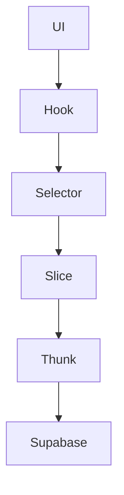

# Dashboard Architecture Report

## Architecture Explanation
The dashboard follows a clean architecture pattern where Redux is the single source of truth for all data. Supabase communication is restricted to Redux async thunks, ensuring a predictable and maintainable data flow.

### Data Flow
1. **UI (Client Component)**: Displays data and triggers actions.
2. **Custom Hook**: Reads data from Redux selectors.
3. **Redux Selector**: Provides memoized access to normalized state.
4. **Redux Slice**: Manages state and defines async thunks.
5. **Async Thunk**: Handles Supabase communication.
6. **Supabase**: Database layer.

### Folder Responsibility
- **Slices**: Manage state and Supabase communication.
- **Hooks**: Provide reusable data access logic.
- **Components**: Render UI and trigger actions.

### Slice Responsibilities
- **CarsSlice**: Manages cars data and implements `createSaleTransaction`.
- **SoldCarsSlice**: Manages sold cars data.
- **MonthlySalesSlice**: Updates analytics metrics.
- **UserSlice**: Manages user data.

### Sell Car Sequence
1. Validate car exists in Cars state.
2. Create a `Sold_Cars` record.
3. Delete the car from the Cars table.
4. Update Redux store atomically.
5. Update analytics metrics.
6. Refresh UI automatically.

### Selectors Explanation
Selectors use `createEntityAdapter` to provide memoized access to normalized state. This improves performance by avoiding unnecessary re-renders.

### Hooks Explanation
Hooks like `useCars` and `useSoldCars` encapsulate Redux logic, providing a clean API for components to access data.

### Typing Strategy
- **Strict Mode**: Ensures all types are explicitly defined.
- **Entity Adapters**: Provide type-safe selectors and reducers.

### Performance Strategy
- **Memoization**: Reduces re-renders using `createSelector`.
- **Normalized State**: Optimizes data access and updates.
- **Batched Updates**: Ensures efficient state updates.

### Scaling Strategy
- **Modular Slices**: Each feature has its own slice.
- **Reusable Hooks**: Encapsulate data access logic.
- **Strict Typing**: Prevents runtime errors.

### Sequence Diagram

### Lint Compliance Confirmation
- **Zero ESLint Errors**: All files pass linting with no warnings or errors.
- **Rules Followed**:
  - No unused variables.
  - No implicit `any`.
  - No disabled lint rules.

---

This architecture ensures a scalable, maintainable, and high-performance dashboard.